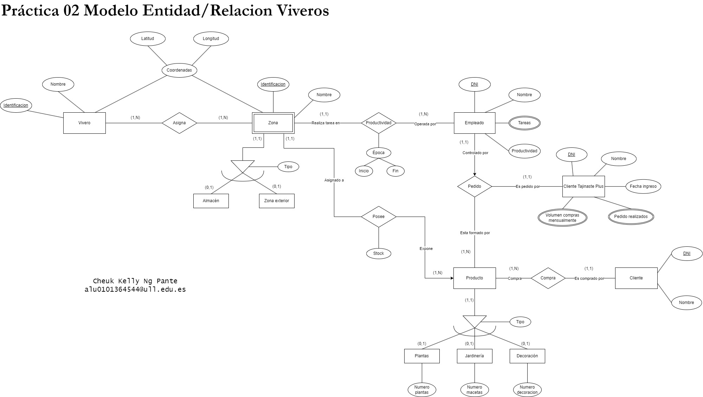

# Modelo entidad/relación. Farmacia
## Objetivos
Los principales objetivos de esta práctica son los siguientes:
* Practicar la modelización conceptual mediante esquemas entidad.
## Recursos
* Draw.io
## Descripción
Crea en Draw.io (u otro software de similares características) un modelo entidad/relación para el siguiente escenario.

La empresa Tajinaste S.A. se dedica a la venta de plantas, productos de jardinería y decoración a través de su red de viveros. En la actualidad están interesados en llevar
un control del stock en los viveros. En cada vivero los productos se asignan a zonas, por ejemplo, zona exterior, almacén, etc. De cada vivero y cada una de las zonas del
vivero se conoce su georreferenciación (latitud y longitud). Se quiere saber de cada producto cuánto hay disponible en cada zona en las que esté asignado.

Del mismo modo se quiere llevar un control de los empleados, que pueden ser destinados a diferentes viveros según la época del año, pero nunca van a tener dos
destinos. En cada vivero que desempeñe una tarea lo hará en una zona, se quiere llevar el control de la productividad de cada zona a lo largo del tiempo, y de cada
empleado. Por esta razón es necesario hacer un seguimiento del histórico del puesto en el que trabajan los empleados.

También se aplica un programa de fidelización, de forma que a un cliente que pertenezca al programa Tajinaste Plus se le asignan bonificaciones en función del
volumen de compras que ha realizado mensualmente. De cara a realizar campañas entre los clientes Tajinaste Plus se controlan los pedidos que estos han realizado
desde su ingreso en el club. Otro de los factores a considerar en la productividad es la capacidad de los empleados de lograr objetivos de venta, por lo que se lleva el
control de los pedidos que gestiona un empleado a los clientes Plus, teniendo en cuenta que cada pedido sólo tiene un responsable.

## Diagrama Entidad/Relación

