# Practica 03: Modelo relacional. Viveros
* Autor: Cheuk Kelly Ng Pante (alu0101364544@ull.edu.es)

# Descripción de la práctica
Partiendo del modelo entidad-relación sobre Viveros ya elaborado, realice el modelo relacional asociado a este escenario. Siéntase libre para modificar el modelo entidad-relación creado si considera que puede mejorarlo.

Debe generar un script SQL con las siguientes características:
* Debe crear una base de datos viveros.
* Debe construir las tablas del modelo relacional. Elija para cada tabla los tipos de atributos más adecuados, las restricciones tipo CHECK así como las
restricciones necesarias para realizar las operaciones de eliminación o actualización de forma oportuna (en cascada, por defecto, etc.).
* Debe definir correctamente los atributos de las tablas que sean derivados
(calculados) en el modelo entidad-relación.
* Incluya al menos 5 filas en cada una de las tablas creadas. Las inserciones
deben abordar todos los escenarios posibles en las tablas involucradas.
* Incluya ejemplos representativos de las operaciones DELETE.

Antes de realizar la entrega, compruebe que puede importar correctamente el script SQL generado en PostgreSQL

## 1. Modelo Entidad/Relación

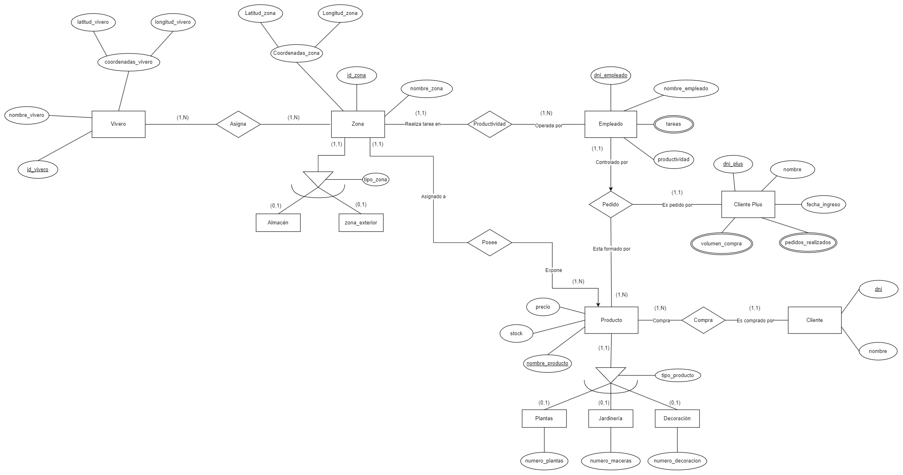

## 2. Transformación a modelo relacional
VIVERO(<u>id_vivero</u>, nombre_vivero, latitud_vivero, longitud_vivero) 

ASIGNA(<u>id_vivero</u>, <u>id_zona</u>)

ZONA(<u>id_zona</u>, nombre_zona, latitud_zona, longitud_zona, tipo_zona)

ALMACEN(<u>id_zona</u>, nombre_almacen)

ZONA_EXTERIOR(<u>id_zona</u>, nombre_zona_exterior)

EMPLEADO(<u>dni_empleado</u>, id_zona, nombre_empleado, tareas, productividad)

PRODUCTO(<u>nombre_producto</u>, id_zona, stock, precio, tipo_producto, dni_empleado, dni_plus, dni_cliente)

PLANTAS(<u>nombre_producto</u>, numero_plantas)

JARDINERIA(<u>nombre_producto</u>, numero_macetas)

DECORACION(<u>nombre_producto</u>, numero_decoracion)

CLIENTE_PLUS(<u>dni_plus</u>, nombre_plus, fecha_ingreso, pedidos_realizados, volumen_compra, dni_empleado)

CLIENTE(<u>dni_cliente</u>, nombre_cliente)

## 3. Modelo Relacional

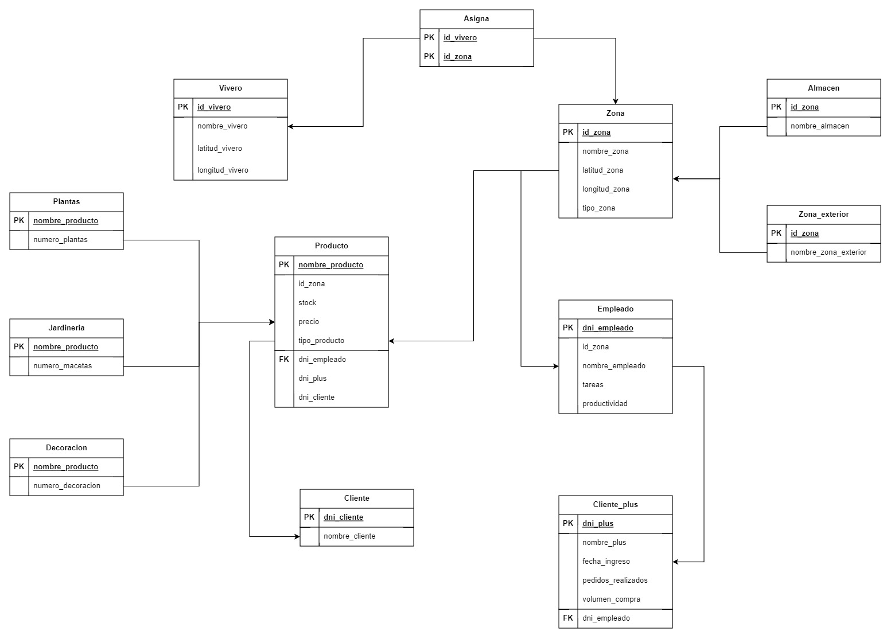

## 4. Uso script
``` bash
sudo -u postgres psql
\i script.sql
```

## 5. Salida del script
### Tabla VIVERO

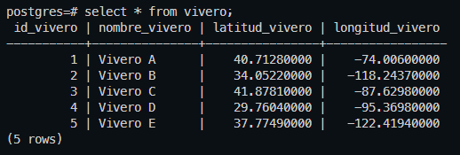

### Tabla ZONA

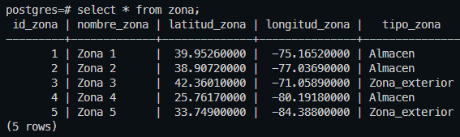

### Tabla ASIGNA

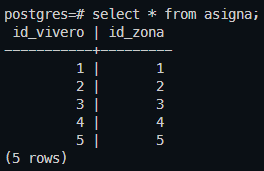

### Tabla ALMACEN

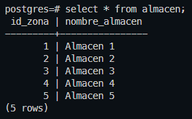

### Tabla ZONA_EXTERIOR

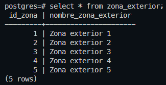

### Tabla EMPLEADO

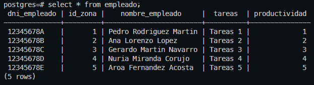

### Tabla CLIENTE_PLUS

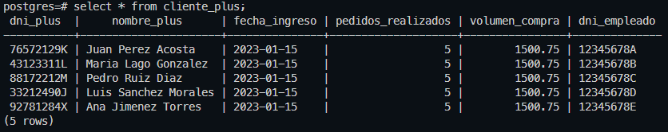

### Tabla CLIENTE

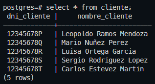

### Tabla PRODUCTO

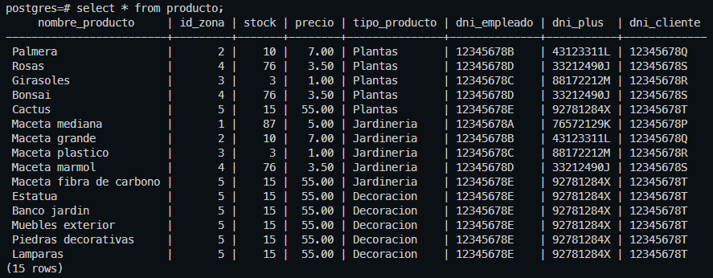

### Tabla PLANTAS

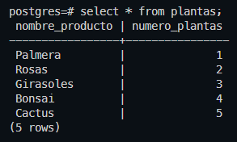

### Tabla JARDINERIA

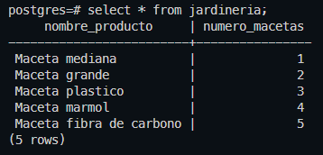

### Tabla DECORACION

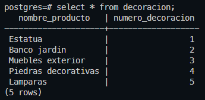

## 6. Ejemplos representativos de las opereaciones `delete`
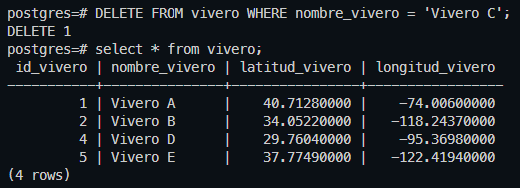

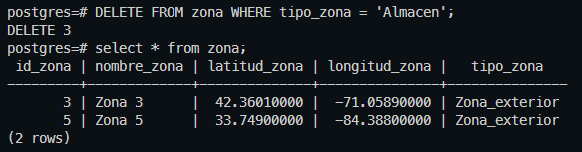

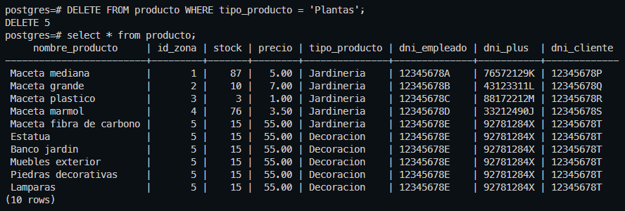
